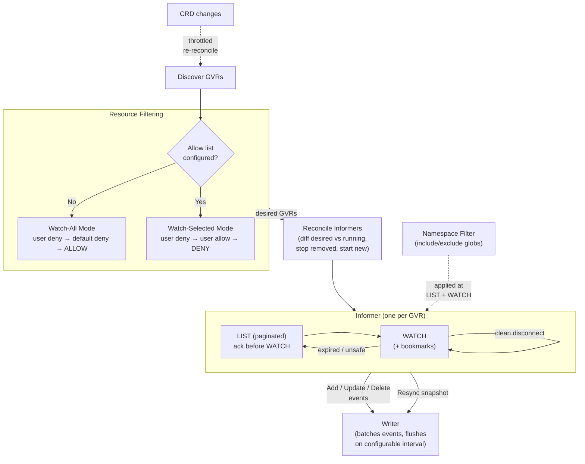
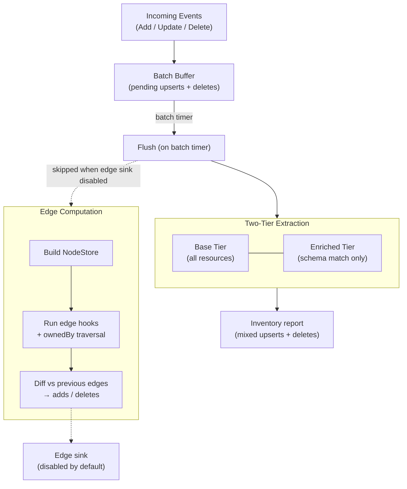
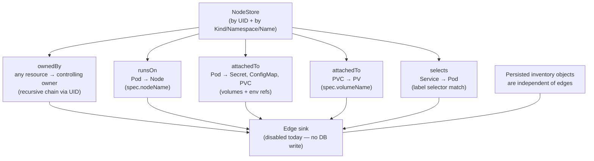
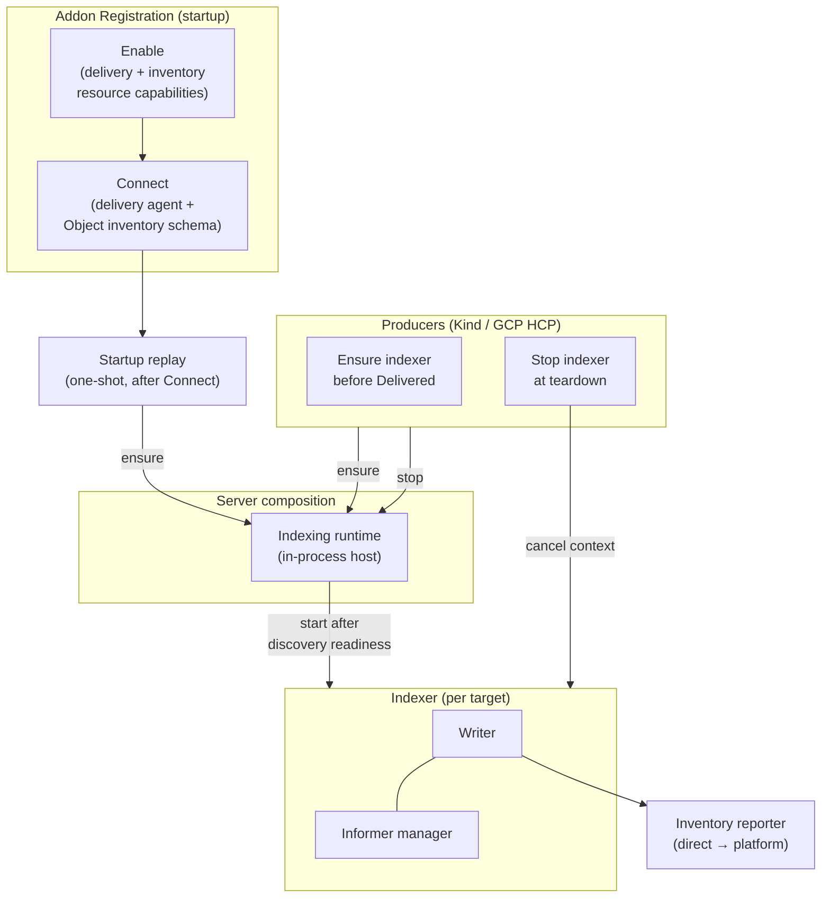

# Kubernetes Addon — Architecture Diagrams

Companion diagrams for [kubernetes-inventory-and-delivery.md](kubernetes-inventory-and-delivery.md). Diagrams 1–3 cover the indexing pipeline; diagram 4 covers platform wiring and indexer lifecycle.

## 1. Watch Pipeline and Configuration

How the inventory engine discovers, filters, and watches Kubernetes resources.

- **Index config** holds per-target behavior: enrichment schema, deny/allow lists, namespace include/exclude globs, and flush interval (default 5s). Producers and startup replay currently start with the default schema only — deny/allow/namespace wiring from target properties is not yet connected
- **Default deny list** excludes high-volume/low-value resources by default: events, leases, endpoints, endpointslices, componentstatuses, OAuth tokens, projects, packagemanifests
- **Configuration precedence**: allow/deny lists use `{apiGroups, resources}` entries with `"*"` wildcard support. The effective config determines the filtering mode: **watch-all** (no allow list) evaluates as user deny → default deny → ALLOW; **watch-selected** (allow list present) evaluates as user deny → user allow (overrides default deny) → DENY. In both modes, deny always wins over allow for the same resource. An allow list that filters to zero watchable GVRs fails discovery readiness
- **CRD reconciliation** is throttled to min 10s between cycles to avoid API server spam during bulk CRD changes (e.g. operator installs). GVR removal stops the informer and drops writer in-memory state only — persisted inventory for that GVR is left unchanged
- **Informer startup** is serialized with a 10s initialization timeout per informer to avoid memory spikes during initial LIST phases. Each informer is tagged with a GVR process generation for writer fencing
- **Informers** track only UID→resourceVersion mappings (not full objects) for minimal memory, plus a watch cursor for clean resume. On shutdown they discard local state and do **not** emit delete events. Clean watch disconnects resume WATCH without LIST; expired/unsafe cursors force LIST
- **Namespace filtering** uses glob patterns evaluated on each event — cluster-scoped resources always pass

## 2. Writer Flush — Two-Tier Extraction, Edges, and DB Writes

How the writer batches events, extracts inventory, optionally computes edges, and persists through the inventory reporter.

- **Event loop** runs on a single goroutine for ordering safety. Deletes win over pending upserts for the same UID (late-delete protection). Closed GVR generations are rejected
- **Deduplication** by resourceVersion — if a resource hasn't changed since the last flush, its upsert is skipped
- **Base tier** projects for all resources: resource name, labels (K8s labels), conditions, observation (GVR, apiVersion/kind, metadata including deletionTimestamp/ownerReferences/annotations), plus in-memory controlling owner UID for edges
- **Enriched tier** runs only for resources with a schema entry that defines fields/hooks: JSONPath fields with type coercion into `observation.extracted`, compute-extra hook, build-edges hook (retained for flush-time edge computation), annotations (opt-in, 64 char cap)
- **No heartbeat**: idle empty reports are a no-op and are not used as a keepalive
- **Resync path**: mixed report of LIST upserts plus deletes for acknowledged UIDs absent from the LIST, scoped to the **current process/GVR generation**. First LIST after process start has an empty acknowledged set (upsert-only). Writer acks only after a successful write so WATCH does not start from an uncommitted cursor
- **Error recovery**: up to 3 attempts with exponential backoff (1s, 2s, 4s). On failure, pending work is retained and acknowledgement/dedup state is NOT advanced — failed items are never silently lost
- **Platform writes**: mixed replacement batch of complete-object upserts and exact-name deletes under `kubernetes.fleetshift.io/Object` (`clusters/{clusterResourceID}/apiResources/{gvrKey}/objects/{uid}`). Topology edges do not flow through the inventory reporter
- **Edge sink**: disabled by default (short-circuits edge diff/delivery); inventory flush still proceeds

## 3. Edge Discovery — Types and NodeStore

How each edge type discovers its targets via the NodeStore. Persistence and query APIs are disabled in the current integration.

- **Two-stage pattern**: edge hooks extract static data from the resource at extraction time (e.g. `spec.nodeName`, volume refs, label selector), then resolve references against the full NodeStore at flush time. This separates cheap parsing from cross-GVR lookups
- **NodeStore** is a dual-indexed view of all current inventory nodes, built when edge diff runs: by UID (ownership chain traversal) and by Kind/Namespace/Name (cross-resource lookups). Cluster-scoped resources use a sentinel empty-namespace key
- **ownedBy** (recursive): walks the controlling `ownerReference` chain via UID lookups with cycle detection. A Pod owned by a ReplicaSet owned by a Deployment produces 2 edges (Pod→ReplicaSet, Pod→Deployment) — the original resource is always the source. Only the controlling owner (`controller: true`) is followed. Runs for all nodes automatically — no schema entry needed
- **attachedTo** (Pod): scans `spec.volumes` (secret, configMap, persistentVolumeClaim) and `spec.containers[].env` (secretKeyRef, configMapKeyRef) at extraction time, then looks up each ref by Kind+Namespace+Name at flush time
- **attachedTo** (PVC→PV): extracts `spec.volumeName`, looks up PersistentVolume as cluster-scoped at flush time
- **selects** (Service→Pod): extracts `spec.selector`, then iterates Pods in the same namespace at flush time and matches label selectors
- **Edge diffing**: edges are keyed by source UID, destination UID, and edge type. When a real sink is configured, each flush computes the full edge set and diffs against the previous set — new keys become adds, missing keys become deletes, unchanged keys are skipped
- **Persistence**: the in-process path disables the edge sink — no DB table, no incoming/outgoing edge queries. Future persistence (platform relationships or a separate topology store) is an open decision

## 4. Indexing Runtime — Platform Integration and Lifecycle

How indexing integrates with addon registration, producers, and server composition.

- **Connect** registers the delivery agent and the inventory-only schema for `kubernetes.fleetshift.io/Object`. Indexing lifecycle is not part of Connect
- **Indexing runtime** is composed in server wiring, not the addon manager. It builds Kubernetes clients, runs discovery readiness, then hosts one indexer per target
- **Ensure / stop** are the lifecycle operations. Ensure is generation-fenced and fingerprint-aware (API server, CA, credential identity, index-config digest). Stop is idempotent and does **not** delete inventory
- **Producers** (Kind, GCP HCP) ensure an indexer before reporting delivery success (with a local retry envelope) and stop it at cluster teardown. Kubernetes delivery itself does not require a running indexer
- **Startup replay**: after Connect, a one-shot pass lists persisted kubernetes targets with resolvable credentials and ensures indexers. It does not poll afterward
- **Unexpected-exit restart**: vault-backed local restart (bounded attempts) when a secret ref is present; raw credential bytes are not retained after start handoff
- **Modularity boundary**: the inventory reporter is the seam between in-process and external agent models. Target-scoped indexed inventory cleanup after target deletion is currently deferred

