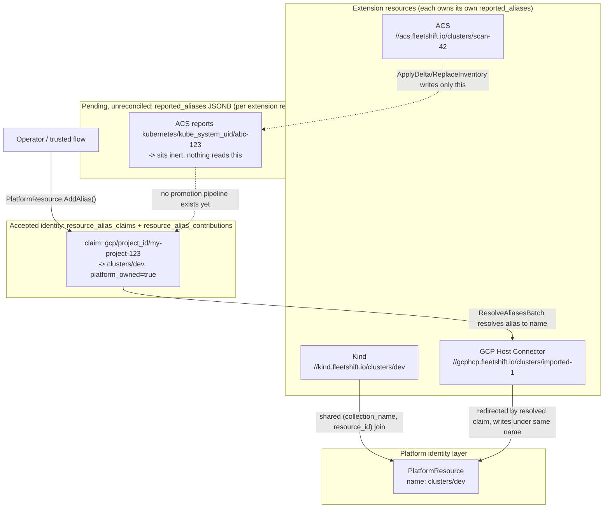
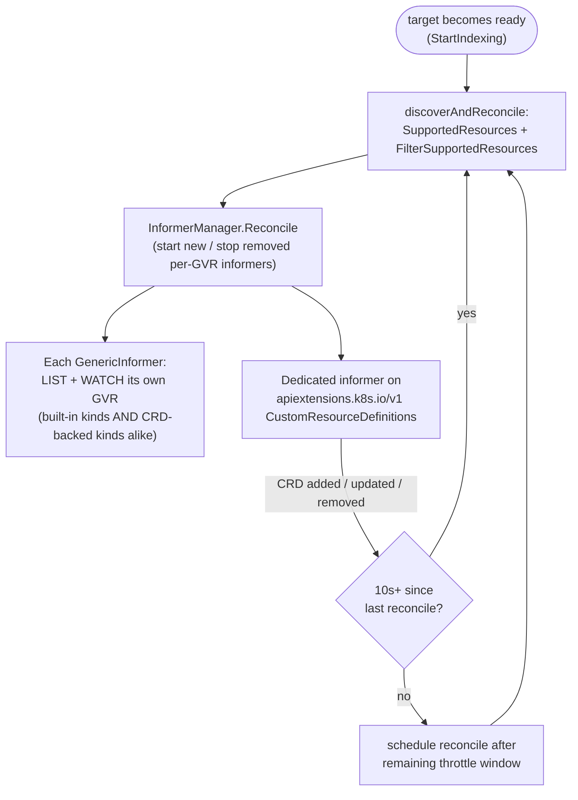
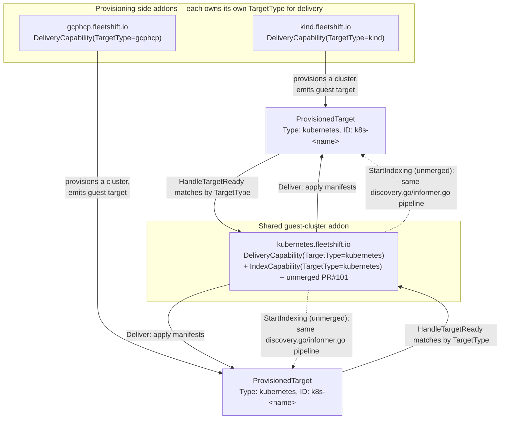
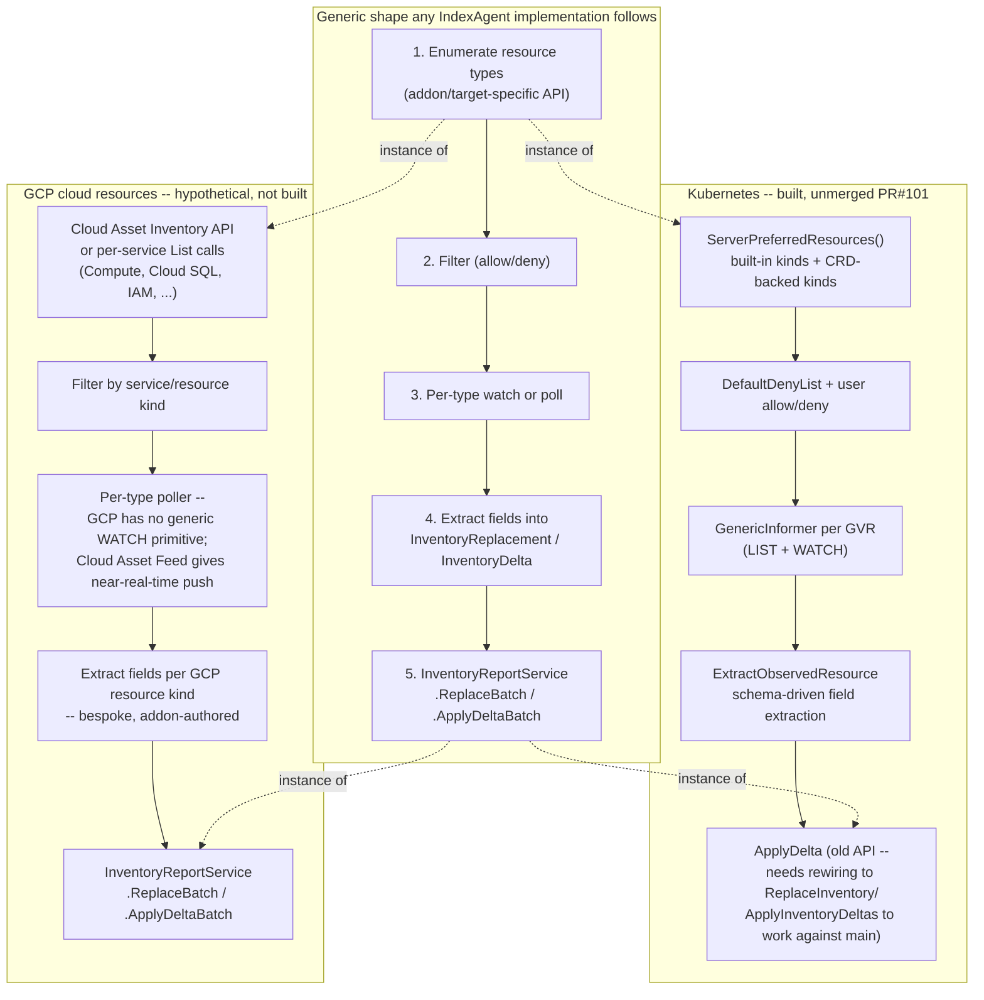

# Kubernetes indexer & identity resolution deep dive (follow-up to the PR #115 review)

This document is a follow-up to [`pr115-inventory-api-review.md`](pr115-inventory-api-review.md). It covers three related but distinct topics that came up in discussion after that review:

1. **Identity resolution mechanics** — a precise, source-grounded explanation of how (and whether) two different extension resources actually get linked to one platform identity via aliases, correcting some imprecise framing from the initial discussion.
2. **The Kubernetes indexing pipeline** — a separate, *unmerged* pull request ([fleetshift/fleetshift-poc#101](https://github.com/fleetshift/fleetshift-poc/pull/101)) that implements the actual Kubernetes-side watcher/discovery/edge-computation agent. This section covers its relationship to ACM's `search-collector`, its CRD-discovery mechanism, and a comparison of GraphQL vs. this PR's relational edge-table approach for exposing relationship data.
3. **All existing extensions, how they relate to discovery today, and how a different extension would add its own** — since only one addon (`kubernetes`, and even that is unmerged) has any discovery logic at all, this section maps out why the other two real addons (`kind`, `gcphcp`) don't need their own Kubernetes-level discovery, and what a bespoke discovery mechanism for a genuinely different kind of target (e.g., GCP cloud resources) would need to look like.

PR #101 and PR #115 are different, independently-authored efforts that are **currently incompatible** — see the "Status" note in Part 2 for details.

---

## Part 1: Identity resolution mechanics

### Terminology: `AliasNamespace` is not a Kubernetes namespace

This is worth stating plainly because the word is reused for two unrelated concepts. From the domain code:

```go
// AliasNamespace scopes an alias key-space (e.g. "gcp", "aws").
type AliasNamespace string
```

`AliasNamespace` is a **naming-authority scope** — it identifies which system defined a particular kind of key, so two unrelated systems can each use a key like `"project_id"` without colliding. It's conceptually the same idea as an XML namespace or a Kubernetes API *group* (e.g., `apps/v1` vs `batch/v1`) — a collision-avoidance prefix. It has nothing to do with a Kubernetes `Namespace` object or `metadata.namespace`.

A real `Alias` looks like:

```go
Alias{
    namespace: "gcp",           // "this key vocabulary belongs to GCP"
    key:       "project_id",    // the specific kind of identifier
    value:     "my-project-123",
}
```

If an alias is *about* a Kubernetes Namespace object (e.g., correlating by the `kube-system` namespace's UID), that's a coincidental overlap of the same English word for two different things:

```go
Alias{
    namespace: "kubernetes",       // AliasNamespace: the naming authority is "Kubernetes"
    key:       "kube_system_uid",  // the kind of identifier: the UID of the kube-system Namespace object
    value:     "abc-123",          // the actual UID value
}
```

### Correlation vs. conflict — these are not the same thing

Two extension resources reporting the *same* alias is not automatically a conflict. There are two distinct cases:

| Case | What it means | Is it a problem? |
|---|---|---|
| Two extension resources report the same alias, and they really are the same real-world thing (e.g., Kind's `clusters/dev` and ACS's scan of the same cluster) | They *should* correlate to one platform identity | No — this is the intended, common case |
| Two extension resources report the same alias, but they're actually different real-world things (bug, typo, stale data, coincidence) | The alias can't tell you which one is "right" | Yes — genuinely ambiguous, needs a decision |

The system cannot tell these two cases apart from alias data alone. Deciding "is this correlation or a collision" needs policy (or a human) — it is not something a `UNIQUE` SQL constraint alone can resolve. This is exactly why identity reconciliation is deferred to a not-yet-built async process rather than solved synchronously on the hot write path (see the "Design evolution" section of `pr115-inventory-api-review.md`).

What the shipped code *does* catch synchronously, cheaply: if a single report supplies multiple aliases that resolve to different existing accepted platform resources, that's an internal self-contradiction within that one report, and it's rejected outright (`reportResolver.resolveByAliases`'s "aliases resolve to different platform resources" error). That check only needs the batch's own already-resolved data — no scan across the whole alias corpus.

### Three tiers of "connecting" two extension resources

There are three distinct mechanisms, only some of which inventory reporting can actually reach.

#### 1. Shared relative name — works today, no alias needed

```sql
CREATE INDEX idx_extension_resources_collection_resource
    ON extension_resources(collection_name, resource_id);
```

If two different extensions independently report under the exact same `(collection_name, resource_id)` — e.g., both use `Name: "clusters/dev"` — they're automatically joined as two representations of the same platform resource via a plain SQL join (see `platformResourceAggregateSelectPostgres`'s `LEFT JOIN LATERAL` over `extension_resources`). No alias, no claim row, no contribution row needed. This is the *"shared relative name"* correlation mentioned in `resource_indexing.md`.

#### 2. Accepted aliases — a real cross-resource linking mechanism, but administratively gated

```sql
CREATE TABLE resource_alias_claims (
    id                        BIGINT GENERATED ALWAYS AS IDENTITY PRIMARY KEY,
    namespace                 TEXT NOT NULL,
    key                       TEXT NOT NULL,
    value                     TEXT NOT NULL,
    platform_collection_name TEXT NOT NULL,
    platform_resource_id      TEXT NOT NULL,
    platform_owned            BOOLEAN NOT NULL DEFAULT false,
    created_at                TIMESTAMPTZ NOT NULL,
    UNIQUE (namespace, key, value),
    UNIQUE (namespace, key, platform_collection_name, platform_resource_id),
    UNIQUE (id, namespace, key)
);

CREATE TABLE resource_alias_contributions (
    source_extension_resource_uid UUID NOT NULL
        REFERENCES extension_resources(uid) ON DELETE CASCADE,
    namespace  TEXT NOT NULL,
    key        TEXT NOT NULL,
    claim_id   BIGINT NOT NULL,
    created_at TIMESTAMPTZ NOT NULL,
    PRIMARY KEY (source_extension_resource_uid, namespace, key),
    FOREIGN KEY (claim_id, namespace, key)
        REFERENCES resource_alias_claims(id, namespace, key)
);
```

`resource_alias_claims` is the actual "alias → platform resource" mapping: one row per `(namespace, key, value)` triple, pointing at exactly one `ResourceName`. The two `UNIQUE` constraints enforce real correctness with plain B-tree indexes:

- `UNIQUE (namespace, key, value)` — the same alias value can never point at two different platform resources (this is what a genuine conflict violates).
- `UNIQUE (namespace, key, platform_collection_name, platform_resource_id)` — the same platform resource can't have two different values for the same `(namespace, key)`.

`resource_alias_contributions` is designed to track *which* extension resources vouched for a claim — a many-to-one join table so multiple extension resources can each contribute a row pointing at the same `claim_id`.

`ResolveAliasesBatch`, called by inventory reporting's `reportResolver` to resolve by-alias reports, is a lookup purely against `resource_alias_claims`:

```go
// ResolveAliasesBatch implements [domain.ResourceIdentityRepository.ResolveAliasesBatch]
// as a single round trip against resource_alias_claims, whose rows already carry
// the owning resource's name directly...
//
// This never consults extension_resources.reported_aliases -- an alias
// absent here simply isn't in the map ResolveAliasesBatch returns,
// whether it was never reported or is still pending reconciliation.
func (r *ResourceIdentityRepo) ResolveAliasesBatch(ctx context.Context, aliases []domain.Alias) (map[domain.Alias]domain.ResourceName, error) {
	...
	rows, err := r.DB.QueryContext(ctx,
		`SELECT namespace, key, value, platform_collection_name, platform_resource_id
		 FROM resource_alias_claims
		 WHERE (namespace, key, value) IN (
			SELECT * FROM UNNEST($1::text[], $2::text[], $3::text[])
		 )`,
		namespaces, keys, values)
	...
}
```

**Critical finding: `resource_alias_claims`/`resource_alias_contributions` are only ever written by `PlatformResource.AddAlias()`**, via `reconcileAliases` in `resource_identity_repo.go` — a path entirely independent of inventory reporting. The domain method itself:

```go
func (r *PlatformResource) AddAlias(alias Alias) error {
	ref := AliasRef{Namespace: alias.Namespace(), Key: alias.Key()}
	if existing, ok := r.aliases.Get(ref); ok {
		if existing == alias {
			return nil // idempotent
		}
		return fmt.Errorf("alias %s/%s already has value %q, cannot set %q: %w",
			existing.Namespace(), existing.Key(), existing.Value(), alias.Value(), ErrInvalidArgument)
	}
	r.aliases = r.aliases.Merge(NewAliasSet([]Alias{alias}))
	return nil
}
```

This operates on one `PlatformResource` aggregate's own alias set, not on any particular extension resource. When persisted (`Create`/`Update` → `reconcileAliases`), it always writes the claim with `platform_owned = true` — i.e., "the platform itself asserts this," a one-at-a-time, presumably-administrative action. `reconcileAliases`'s own doc comment confirms:

```go
// reconcileAliases reconciles resource_alias_claims against s.Aliases
// -- the PlatformResource aggregate's own complete, current view of
// the aliases it asserts directly (as opposed to ones merely
// contributed by some extension resource's inventory report; ...)
```

#### 3. Reported (pending) aliases — not linked to anything

```sql
CREATE TABLE extension_resources (
    ...
    reported_aliases  JSONB NOT NULL DEFAULT '{}'::jsonb,
    ...
);
```

This is what `InventoryReplacement.Aliases`/`InventoryDelta.UpsertAliases` actually write to. It's a flat JSON blob keyed by `(namespace, key)`, sitting on the one reporting resource's own row. It's not joined, not looked up, not cross-referenced by anything else. The write path's own source comment confirms this explicitly:

```go
// Note that inventory reporting (ReplaceInventory/ApplyInventoryDeltas)
// no longer populates resource_alias_claims/resource_alias_contributions
// at all (see those tables' own doc comments), so in practice this
// cleanup only ever has work to do for platform-owned claims added
// via [ResourceIdentityRepository]'s AddAlias path -- kept anyway
// since that path remains reachable and this repository has no way to
// know which mechanism produced a given claim.
```

I searched the production code for any `INSERT INTO resource_alias_contributions` and found none — not in `postgres/extension_resource_repo.go`, not in `postgres/resource_identity_repo.go`, nor their SQLite equivalents. The table, its indexes, and the cleanup logic that reads it (for orphan detection on delete) all exist, but **nothing currently inserts a row into it**. It's schema built ahead of a promotion pipeline that hasn't been written yet.

### Putting it together — how two extensions actually get connected today



Solid arrows are working paths today; the dashed arrows show why ACS's own reported alias never connects it to `clusters/dev` on its own — it has no route into the accepted `resource_alias_claims` table without an operator (or some future reconciler) explicitly promoting it.

**What works:**

1. **Shared name.** Both reporters already know (or are told) the same canonical name and report under it directly. Zero alias machinery involved.
2. **Alias-assisted redirection to a *pre-registered* name.** An operator (or some other trusted, non-inventory-reporting flow) calls `PlatformResource.AddAlias()` on an *already-existing* platform resource, registering an alias against it (`platform_owned = true`). A later by-alias report that doesn't know the name gets redirected to that registered name by `ResolveAliasesBatch`, and lands its `extension_resources` row under that same `(collection_name, resource_id)` — which is then joined to the other extension's row via mechanism #1 above.

**What does not work (yet):**

There is no path where two addons independently reporting the same *brand-new* alias — one neither has registered before — get automatically linked to each other. `reported_aliases` (pending) never gets promoted into `resource_alias_claims`/`resource_alias_contributions` (accepted). That promotion pipeline is the "future asynchronous reconciler" referenced throughout PR #115's design notes, and it does not exist in the codebase today.

---

## Part 2: The Kubernetes indexing pipeline (PR #101)

### Status

[fleetshift/fleetshift-poc#101](https://github.com/fleetshift/fleetshift-poc/pull/101) ("Kubernetes indexing pipeline with edge computation and lifecycle integration," branch `feat/inventory-agent02`, author mshort55) is a **separate, still-open, unmerged PR**. It implements the actual watcher/discovery/extraction/edge-computation agent for Kubernetes targets — the piece that would call into an `InventoryWriter`.

**It is currently incompatible with `main`.** As found in an earlier review pass:

- It predates PR #112's `ExtensionResourceSchema` rename and PR #115's `ExtensionResourceRepository`/`ReplaceInventory`/`ApplyInventoryDeltas` API entirely.
- It targets the *older* `domain.InventoryWriter`/`InventoryItem`/`ApplyDelta`/`Resync` interface (`ApplyDelta(ctx, targetID, upserts []InventoryItem, deletedIDs, edgeAdds []InventoryEdge, edgeDels []InventoryEdge) error`), not the natural-key-addressed `InventoryReplacement`/`InventoryDelta` model that shipped in PR #115.
- It redefines `InventoryType` as a `string` (a rename of the old `InventoryItemType`), which collides with the *different*, already-shipped `InventoryType struct{}` capability marker on `ExtensionResourceType` in current `main`.
- The on-`main` `addon/kubernetes` package today (`agent.go`, `applier.go`, `descriptor.go`) is **delivery-only** — it applies manifests to a cluster. None of the discovery/watch/extraction/edge code below exists on `main`.

So everything in this section describes designed-but-unmerged functionality, not something currently usable.

### CRD ("kind") discovery mechanism

The indexer discovers what Kubernetes resource kinds — including arbitrary CRD-backed kinds — exist on a target cluster, dynamically, without any hardcoded list.

```go
// SupportedResources returns all GVRs on the cluster that support the WATCH verb.
// It uses ServerPreferredResources to get the preferred API version for each resource.
func SupportedResources(client discovery.DiscoveryInterface, logger *slog.Logger) (map[schema.GroupVersionResource]struct{}, error) {
	apiResources, err := client.ServerPreferredResources()
	...
}
```

`ServerPreferredResources()` is the standard Kubernetes discovery API — it returns *every* API resource the target cluster's API server currently exposes. It makes no structural distinction between a built-in kind (`Pod`, `Deployment`) and a CRD-backed kind (`VirtualMachine`, a custom operator's CRD, etc.) — both simply appear as `APIResource` entries under their group/version. This means it applies uniformly whether the cluster was created by the platform (e.g., via the Kind addon) or imported as a pre-existing cluster (e.g., via GCP Host Connector) — discovery only talks to the live API server, not any platform-side record of "how this cluster came to be."

Discovered GVRs are filtered through an allow/deny system:

```go
// DefaultDenyList contains resource types that should never be watched by default.
var DefaultDenyList = []Resource{
	{ApiGroups: []string{""}, Resources: []string{"events"}},
	{ApiGroups: []string{"coordination.k8s.io"}, Resources: []string{"leases"}},
	{ApiGroups: []string{""}, Resources: []string{"endpoints"}},
	...
}
```

The default mode is "watch everything except a short deny-list of noisy resources" — arbitrary CRDs are watched by default, not opt-in.

Discovery is not a one-time, startup-only action — it's live and reactive to CRD changes:

```go
// RunContinuous performs initial discovery + reconciliation, then starts a CRD
// informer that triggers throttled re-reconciliation whenever CRDs change.
func (m *InformerManager) RunContinuous(ctx context.Context, denyList, allowList []Resource) {
	m.discoverAndReconcile(ctx, denyList, allowList)

	crdGVR := schema.GroupVersionResource{
		Group: "apiextensions.k8s.io", Version: "v1", Resource: "customresourcedefinitions",
	}
	crdInformer := NewInformer(m.client, crdGVR, crdEventCh, crdResyncCh, nil, m.logger)
	go crdInformer.Run(crdCtx)
	...
	// on any CRD add/update/delete event -> throttled re-reconcile (min 10s)
}
```

A dedicated informer watches `CustomResourceDefinition` objects themselves. Whenever a CRD is installed, updated, or removed on the target cluster, this triggers a throttled (minimum 10 seconds between cycles) re-discovery and re-reconciliation of the running informer set — so a newly-installed custom kind starts being watched automatically, without a restart.



The loop on the right is what makes CRD/kind discovery dynamic rather than a one-time startup scan: installing a new CRD on the target cluster feeds back into rediscovering and watching the kind it defines, without restarting the agent.

### Comparison to ACM's `search-collector`

This code is not merely "architecturally similar" to ACM's real `search-collector` (`stolostron/search-collector`) — the source contains direct, explicit evidence of derivation from it. From `informer.go`:

```go
// BUG FIX 1: write newResourceIndex back (search-collector never did this).
i.resourceIndex = newResourceIndex
```

```go
// BUG FIX 2: pass the list's resourceVersion instead of empty ListOptions.
```

These comments name `search-collector` explicitly as the thing being compared against and corrected — not a generic description of informer best practice. This indicates the author either ported ACM's actual collector code or studied it closely enough to identify and fix two specific correctness bugs (informers should carry the LIST's resource-version forward into the subsequent WATCH call to avoid a gap or spurious full resync; the local UID→resourceVersion index must be replaced, not left stale, after each LIST+resync cycle).

| Aspect | ACM `search-collector` (real) | This PR's Kubernetes indexer |
|---|---|---|
| Deployment model | One pod per managed/spoke cluster, via an ACM add-on | One `Agent`/`indexerDelegate` per target, run by `AgentPool` |
| Discovery | `ServerPreferredResources()` to enumerate watchable GVRs | Identical |
| Informer implementation | Custom hand-rolled LIST+WATCH loop, not `client-go`'s `SharedInformerFactory` (for memory/scale reasons across many GVRs) | Identical approach — `GenericInformer` |
| CRD-driven reconciliation | Watches `CustomResourceDefinition`; re-discovers + reconciles informers on CRD change | Identical — `RunContinuous`'s dedicated CRD informer, throttled |
| Resource filtering | Excludes high-volume/sensitive kinds by default | `DefaultDenyList` — same shape |
| Per-kind extraction + generic fallback | `pkg/transforms`: hand-written per-kind functions + generic fallback for unknown/CRD kinds | Same two-tier design (base tier + `schema_default.go` enriched tier) |
| Relationship/edge computation | Ownership-chain edges, Pod→Node, Service→Pod via selectors, PVC→PV | Same four edge types, same semantics: `ownedBy` (recursive walk), `runsOn`, `attachedTo`, `selects` |
| Batching + resend dedup | Batches events; tracks last-sent resourceVersion per UID; periodic full resync | Identical — `Writer.flush`, `sentVersions`, `sendResync` |
| Bug-for-bug corrections | (baseline) | Explicitly fixes two informer correctness bugs found in the original |

**Where they diverge:**

1. **Query/API layer.** ACM's `search-indexer` is queried through `search-api`, which is a **GraphQL** service. FleetShift's documented intent (`resource_indexing.md`) is deliberately not GraphQL — a single AIP-style REST method, `GET /apis/fleetshift.io/v1/{scope}:searchResources?filter={cel_expression}`, using CEL for filtering. The collector-side plumbing was copied closely; the query-side architecture was not.
2. **Generality.** ACM's collector is hardcoded to Kubernetes and ACM's own indexer schema. FleetShift wraps the same collector logic behind a generic `domain.InventoryWriter`/`IndexAgent` interface so any addon (not only Kubernetes) can plug into the same platform-side inventory pipeline.
3. **Identity model.** ACM search has no equivalent of FleetShift's platform-resource/alias/representation correlation layer (Part 1 of this document) — it doesn't need to correlate the same physical thing across multiple different addon-services the way FleetShift's model does.

### The relevant edge-computation code (for reference)

```go
type EdgeType string

const (
	EdgeOwnedBy    EdgeType = "ownedBy"
	EdgeRunsOn     EdgeType = "runsOn"
	EdgeAttachedTo EdgeType = "attachedTo"
	EdgeSelects    EdgeType = "selects"
)

// commonEdges recursively walks the ownership chain via OwnerUID,
// creating an "ownedBy" edge for each level. Cycle detection prevents
// infinite loops.
func commonEdges(uid string, ns NodeStore) []Edge { ... }
```

`Writer.flush` computes edges per batch by combining type-specific `BuildEdges` closures (registered per schema entry) with the universal `commonEdges` ownership-chain walk, diffs the result against a `previousEdges` map to produce adds/deletes, and calls `InventoryWriter.ApplyDelta` with both the item and edge deltas together.

### GraphQL vs. the relational edge-table approach

An edge table (as implemented here: `source_uid, dest_uid, edge_type, source_kind, dest_kind` rows, queried via `ListBySourceUID`/`ListByDestUID`) and GraphQL are not strictly competing alternatives — one is a *storage/computation* decision, the other a *query-interface* decision. A GraphQL resolver layer could in principle sit on top of this exact edge table later without changing storage at all. But since ACM itself uses GraphQL for its query layer and FleetShift's docs explicitly choose not to, it's a real, meaningful design fork.

**GraphQL (ACM's actual approach):**

*Benefits*
- Native multi-hop traversal in one request — "get this Deployment, its Pods, and each Pod's Node" resolves as nested fields in a single query. This is literally ACM search console's UX: click a resource, see everything related, click again to go deeper.
- Client-specified field selection avoids over-fetching.
- Strong typing + introspection give good tooling/codegen for a dedicated UI team.

*Drawbacks*
- Query cost/DoS risk — deep or broad nested queries can trigger large backend fan-out; needs depth/complexity limiting.
- Hard to cache at the HTTP layer (typically POST-with-body; no free CDN/browser caching the way GET-based REST gets).
- N+1 query problem unless a dataloader/batching layer is built.
- A second API paradigm alongside the rest of the platform: FleetShift's entire surface is built on Google AIP conventions with generated HTTP transcoding (`docs/api-design.md`, `DynamicHTTPMux`). GraphQL needs its own schema, its own per-field auth story, its own client tooling — none of it reuses the AIP/proto infrastructure already built for every other resource type.
- Awkward fit for an addon-extensible, dynamically-growing type system — GraphQL schemas are normally fixed at deploy time, while FleetShift's resource types grow as addons connect at runtime, pushing toward generic `JSON`/`Struct`-typed fields that give up most of GraphQL's typing benefit anyway.

**Relational edge table (this PR's approach):**

*Benefits*
- One query paradigm for the whole platform — edges become just another filterable dimension inside the same CEL-filtered `searchResources` method; no second API surface, no second auth model.
- Simple, cheap writes — `Writer.flush` diffs a plain Go map (`previousEdges`) against newly computed edges and issues straightforward upsert/delete SQL; no resolver graph to execute on the write path.
- Efficient single-hop lookups — `ListBySourceUID`/`ListByDestUID` are simple indexed point queries, cheap for the common case (what does this Pod belong to?).
- No separate engine to run, scale, or secure — it's more rows in the same database already backing everything else.

*Drawbacks*
- Multi-hop traversal is awkward — "show me everything related to X, 3 hops out" needs either a recursive CTE (the design's own history explicitly flags this as risky — see the abandoned 28-CTE statement discussed in `pr115-inventory-api-review.md`'s design evolution) or the caller issuing several sequential lookups and stitching results together itself.
- No client-driven shaping — callers get full rows; no free equivalent of "just these 3 fields across this whole traversal" (addressable via AIP field masks, but not free).
- Weaker self-description — no introspection; a client must already know the edge-type vocabulary from docs, not from the API itself.
- Edge semantics are currently narrow and Kubernetes-specific, hardcoded via Go `BuildEdges` closures per resource kind — not a generic graph capability other addons get for free.

**Takeaway:** FleetShift copied the genuinely hard-to-get-right part of ACM's design (watch/list correctness, dedup, batching, CRD-reactive discovery) but deliberately did not copy ACM's query layer, trading ACM's signature "click through relationships" UX for one platform-wide, AIP-consistent search surface that fits an addon-extensible type system better. The real gap this leaves: rich exploratory graph browsing like ACM's search console would need either a GraphQL layer on top of this same edge data, or a bespoke "expand relationships" REST method — the flat CEL-filtered endpoint alone doesn't give that experience for free.

---

## Part 3: All existing extensions — target types, discovery, and how another extension would add its own

### The three real addons in this codebase today

| Addon | ID | Capabilities declared on `main` | Discovery/indexing logic? |
|---|---|---|---|
| `kind` | `kind.fleetshift.io` | `DeliveryCapability{TargetType: "kind"}`, `ManagedResourceCapability{ClusterResourceType}` | None. Delivery-only. |
| `gcphcp` | `gcphcp.fleetshift.io` | `DeliveryCapability{TargetType: "gcphcp"}`, `ManagedResourceCapability{ClusterResourceType}` | None. Delivery-only. |
| `kubernetes` | `kubernetes.fleetshift.io` | `DeliveryCapability{TargetType: "kubernetes"}` (on `main`) | None on `main`. PR #101 (unmerged) adds `IndexCapability{TargetType: "kubernetes"}` + the full discovery/informer/writer pipeline covered in Part 2. |

`IndexCapability` and `IndexAgent` do not exist anywhere on `main` today — confirmed by search. They are exclusively part of the unmerged PR #101.

### Why `kind` and `gcphcp` don't need their own Kubernetes-level discovery

This is the key structural fact that makes "only one extension has discovery" less surprising than it first looks: **`kind` and `gcphcp` each provision a real Kubernetes cluster, and both explicitly register that provisioned cluster as a *separate*, generically-typed target — `TargetType: "kubernetes"` — rather than under their own addon-specific type.**

From `kind`'s `cluster_output.go`:

```go
// KubernetesTargetType is the [domain.TargetType] for Kubernetes
// clusters provisioned by the kind addon. The kubernetes-direct
// delivery agent handles delivery to these targets.
const KubernetesTargetType domain.TargetType = "kubernetes"

func (o *ClusterOutput) Target() domain.ProvisionedTarget {
	...
	return domain.ProvisionedTarget{
		ID:   o.TargetID,       // "k8s-" + cluster name
		Type: KubernetesTargetType,
		...
	}
}
```

From `gcphcp`'s `target_ids.go` / `descriptor.go`:

```go
// KubernetesTargetType is the [domain.TargetType] for Kubernetes
// clusters provisioned by the GCP HCP addon.
const KubernetesTargetType domain.TargetType = "kubernetes"

// GuestTargetID returns the ID of the emitted Kubernetes target for a
// provisioned hosted cluster.
func GuestTargetID(clusterName string) domain.TargetID {
	return domain.TargetID("k8s-" + clusterName)
}
```

Both addons follow the identical pattern independently. This produces a clean **two-target model** per provisioned cluster:

1. **The provisioning/control-plane target** — `TargetType: "kind"` or `TargetType: "gcphcp"`. This is where the platform delivers "create/update/delete this cluster" manifests. Each addon owns and handles this type exclusively.
2. **The guest/workload target** — `TargetType: "kubernetes"`, shared and generic. This represents the *resulting* cluster's own API server. Because both addons register it under the same shared type, **any addon that declares a capability for `TargetType: "kubernetes"` automatically applies to it** — dispatch is by target type, not by which addon happened to provision the target. In PR #101's (unmerged) `AddonManager`, this is `HandleTargetReady`'s `hasIndexCapabilityForTargetType(rec.addon.Capabilities, target.Type())` check: it dispatches `StartIndexing` to any connected addon whose declared `IndexCapability.TargetType` matches the target's own type, with no reference at all to which addon originally provisioned that target.



**The consequence:** once PR #101's `IndexCapability`/`IndexAgent` lands (and is rebased onto PR #115's write API), `kind` and `gcphcp` inherit full CRD/kind discovery and indexing *for free*, for everything happening *inside* the clusters they provision — Pods, Deployments, arbitrary CRDs, all of it — without writing a single line of discovery code themselves. This is exactly why only one addon needs discovery logic: it isn't that the other two are missing something, it's that "index whatever's inside a Kubernetes API server" is a generic capability that applies uniformly to any target of that shared type, regardless of who provisioned it.

### What would still need bespoke discovery

The free ride above only covers what's visible *through the guest cluster's own Kubernetes API*. It does **not** cover anything an addon's own control plane manages that lives *outside* that API surface. For `gcphcp`, that's the actual GCP-level cloud resources backing the hosted control plane — the GCE instances, networking, IAM bindings, etc. that Kubernetes' own discovery API has no visibility into at all. An addon in that position would need its own bespoke discovery mechanism, following the same *shape* as the Kubernetes one but built against entirely different primitives:



The important thing carried across both concrete instances is the *bottom* of the pipeline, not the top: whatever addon-specific discovery/enumeration mechanism a new extension builds, it ends up calling the same generic `InventoryReportService.ReplaceBatch`/`ApplyDeltaBatch` API from PR #115 — that's the one piece every addon shares, regardless of what kind of target it's discovering things on. Kubernetes' discovery API happens to make step 1-3 unusually clean and generic (one call enumerates everything, one primitive — WATCH — covers every kind); a cloud-provider addon doing the same thing would need more bespoke, per-service code for those same steps, because most cloud provider APIs don't offer a single generic "list every kind of resource, then watch all of them" primitive the way Kubernetes does.

### Where this connects back to aliases (Part 1)

If `gcphcp` ever built the hypothetical GCP-resource indexer above, it would very plausibly end up reporting inventory for *the same physical thing* that the shared `kubernetes` indexer already reports on from a different angle — e.g., a GCE instance backing a Kubernetes `Node` object. That's exactly the correlation scenario Part 1 describes: two different extension resources (`//gcphcp.fleetshift.io/instances/...` from the new hypothetical indexer, `//kubernetes.fleetshift.io/.../nodes/...` from the existing one) describing one real-world thing, needing to be linked via a shared name or an alias (e.g., a GCP instance ID) for the platform to present them as one correlated identity rather than two disconnected records. The identity/alias mechanics in Part 1 apply exactly the same way regardless of which addon originates the report — aliases are the general-purpose correlation mechanism precisely because different addons will inevitably discover overlapping real-world resources through completely different discovery mechanisms, as this section illustrates.
