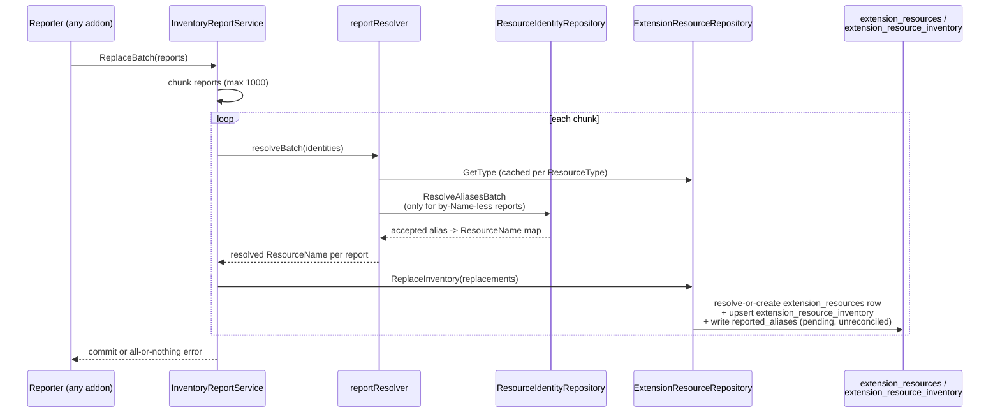

# Inventory reporting API review — PR #115

## PR metadata

- **Title**: OME-131: Add batch inventory reporting to the extension resource model
- **PR**: [fleetshift/fleetshift-poc#115](https://github.com/fleetshift/fleetshift-poc/pull/115)
- **Author**: alechenninger
- **Status**: Merged (2026-07-07)
- **Base / head**: `main` (`8f91490`) ← `ome-131/inventory-report` (`d67c28b`)
- **Size**: 69 files changed, +16,067 / -2,972, 22 commits

This document reviews the inventory reporting API surface introduced by PR #115: the domain types, repository interface, and application service that let addons report what they observe (Kubernetes objects, cloud-provider resources, etc.) into the platform's extension resource model. It quotes the merged API definitions verbatim (with their doc comments) as a reference, followed by a scored review.

Related design docs:

- [`../architecture/resource_indexing.md`](../architecture/resource_indexing.md) — the fleet-wide inventory and search model this API implements a slice of
- [`../architecture/resource_identity_and_api.md`](../architecture/resource_identity_and_api.md) — the two-layer API model and platform resource identity this API integrates with
- [`../managed_resources.md`](../managed_resources.md) — the managed-resource projection this API's data feeds

---

## Design context

### Problem

Addons need to report what they observe about resources in the fleet (Kubernetes objects, cloud-provider resources, etc.) into a queryable platform inventory, at a latency and throughput comparable to established fleet-search systems (the PR uses ACM's search indexer as its baseline), without requiring a heavyweight per-item round trip for identity resolution.

### Design evolution

The PR description documents six iterations, explored and measured within the branch rather than decided up front:

1. **First draft** (`563fb87`) — resolve-or-create platform identity and an extension-resource UID up front, then synchronously write inventory plus full observation/condition-transition history, checking alias uniqueness by reading and rewriting platform-resource-level alias state. Functionally complete, but every step is a round trip (or a read-modify-write) multiplied across a batch.
2. **Latency iteration and more realistic benchmarking** (`862b9fe`, `1ad99b1`, `83747d0`, `c095406`, `aa51379`, `372a9bf`) — tightened the alias upsert path, fixed correctness bugs surfaced by more thorough tests, made benchmark seeding representative of steady-state churn instead of always-fresh data.
3. **Two-table claims/contributions alias model, wired synchronously into the hot path** (`9bd72ba`, `b7efdb7`, `2584892`) — replaced ad hoc alias bookkeeping with `resource_alias_claims` (one row per `(namespace, key, target)`) + `resource_alias_contributions` (one row per contributing extension resource), so plain `UNIQUE` B-tree indexes catch both "same key/value, different resource" and "different key/value, same resource" conflicts without `EXCLUDE`/GiST. This design, combined with full observation/condition-transition history tables, is preserved in full as [`archive/inventory-history-normalized-cte`](https://github.com/fleetshift/fleetshift-poc/tree/archive/inventory-history-normalized-cte) for anyone who wants the fuller, synchronously-consistent, history-keeping version as a reference or a future starting point.
4. **Async alias resolution, explored as its own POC** (`8101872`, `poc/inventory-identity-reconciliation/`) — hot path writes latest inventory plus a reported-identity assertion only; a separate (unbuilt, this iteration) reconciler would promote non-conflicting assertions into accepted platform identity and record real conflicts for the rest.
5. **The final rewrite** (`4a86bde`) adopts the async idea but takes a deliberately narrower slice for a first pass: drops synchronous observation/condition-transition history from the hot path entirely (kept only in the archived design); collapses per-resource labels/conditions into JSONB columns on a single `extension_resource_inventory` row; turns reported aliases into a **pending, unreconciled JSONB payload** on `extension_resources` rather than a synchronously conflict-checked write.
6. **Hot-path tightening** (`69866ed`, `7d558c9`) — folded alias writes into the same single CTE statement as inventory (payload-equality skip via `IS DISTINCT FROM` on canonicalized `reported_aliases` JSONB), trimmed excess work from observation-only deltas.

Two standalone POCs fed into the design without being wired into production code: `poc/alias-claims/` (the claims/contributions unique-index approach, benchmarked before adoption) and `poc/inventory-write-path/` (the CTE-chained mega-statement approach, benchmarked against an ACM-style baseline; this surfaced a Postgres query-planning cliff documented in `open_questions.md`'s "Alias write path" entry).

### Key design decisions

- **Platform resources have no UID.** AIP-148 makes `uid` optional, and a platform resource has no "generation" to distinguish — it's an aggregation shell over independently-lived extension resource representations. A name is visible through the platform API as soon as anything backs it (a representation, an alias, an explicit `Create`), materialized lazily. Using the name as the common key avoids needing to upsert or resolve a platform resource UID inside a reporting batch.
- **Natural-key addressing.** Reporters identify resources by `(ResourceType, ResourceName)` or by alias, never by `ExtensionResourceUID`. The repository resolves-or-creates the underlying row within the same write.
- **Latest state, not history, on the hot path.** `extension_resource_inventory` stores latest `observation`/`labels`/`conditions` as JSONB in one row per resource, GIN-indexed. Synchronous observation/condition-transition history writing is removed from the hot path; `ListObservations`/`ListConditionTransitions` are kept as always-empty-today interface methods for a future async writer.
- **Pending, unreconciled aliases.** `InventoryReplacement.Aliases` / `InventoryDelta.UpsertAliases` are stored verbatim as a canonicalized JSONB payload on `extension_resources.reported_aliases`. The write path skips the alias `UPDATE` entirely when the incoming payload is unchanged (the common re-report-same-aliases case). There is no synchronous cross-resource conflict detection — two reports may freely assert the same alias for different resources. Reconciliation into accepted platform identity is deferred to future async work.
- **Two reporting modes.** `ReplaceBatch` treats each report as the complete latest inventory state (absence = deletion, except for `Observation`); `ApplyDeltaBatch` applies incremental, field-level changes.

---

## API reference

All source below is quoted verbatim from `fleetshift-server/internal/domain/` and `fleetshift-server/internal/application/` on `main` as of the PR merge commit, including doc comments.

### Capability marker: `InventoryType`

Marks an `ExtensionResourceType` as supporting inventory reporting.

```go
// InventoryType is a capability marker for an extension resource type.
// When present on an [ExtensionResourceType], it indicates that
// instances of the type support inventory reporting.
type InventoryType struct{}

// NewInventoryType constructs an [InventoryType].
func NewInventoryType() InventoryType { return InventoryType{} }
```

Attached to a type via the `WithInventory` functional option:

```go
// WithInventory marks an extension resource type as supporting
// inventory reporting.
func WithInventory() ExtensionResourceTypeOption {
	return func(t *ExtensionResourceType) {
		it := NewInventoryType()
		t.inventory = &it
	}
}
```

`ExtensionResourceType` carries the marker as an optional pointer alongside the (also optional) `ManagementType`, so a type can be managed-only, inventory-only, or both:

```go
// ExtensionResourceType is the type definition that describes an
// extension resource kind. It carries API identity fields (service
// name, version, collection) and optional capability metadata for
// management (fulfillment relation and attestation signature) and/or
// inventory (observation schema).
//
// Unlike the former ManagedResourceTypeDef which used public fields,
// this type uses private fields with accessors per domain.md
// conventions.
//
// Both management and inventory are modeled as optional pointers so a
// type can be managed-only, inventory-only, or both.
type ExtensionResourceType struct {
	resourceType ResourceType
	apiVersion   APIVersion
	collectionID CollectionID
	management   *ManagementType
	inventory    *InventoryType
	createdAt    time.Time
	updatedAt    time.Time
}

// Inventory returns the inventory metadata, or nil for types that do
// not support inventory reporting.
func (t ExtensionResourceType) Inventory() *InventoryType { return t.inventory }
```

### Instance-level inventory state: `InventoryResource`

Holds the latest inventory state for an extension resource instance.

```go
// InventoryResource holds the latest inventory state for an extension
// resource instance. Reconstituted from persistence via snapshot.
//
// observation is a pointer so "no latest observation" (nil) is
// representable distinct from "the latest observation is an empty JSON
// object" ({}).
type InventoryResource struct {
	labels      map[string]string
	observation *json.RawMessage
	conditions  []Condition
	observedAt  time.Time
	updatedAt   time.Time
}

func (ir *InventoryResource) Labels() map[string]string     { return ir.labels }
func (ir *InventoryResource) Observation() *json.RawMessage { return ir.observation }
func (ir *InventoryResource) Conditions() []Condition       { return ir.conditions }
func (ir *InventoryResource) ObservedAt() time.Time         { return ir.observedAt }
func (ir *InventoryResource) UpdatedAt() time.Time          { return ir.updatedAt }
```

It hangs off the extension resource aggregate:

```go
// Inventory returns the latest inventory state, or nil if no inventory
// has been reported.
func (r *ExtensionResource) Inventory() *InventoryResource { return r.inventory }

// ReportedAliases returns this extension resource's own pending,
// unreconciled alias assertions -- see [InventoryReplacement.Aliases]'s
// doc for the contract these are stored under.
func (r *ExtensionResource) ReportedAliases() AliasSet { return r.reportedAliases }
```

### Conditions

Kubernetes-style conditions (type, status, reason, message, last-transition-time):

```go
// ConditionType identifies a category of condition (e.g. "Ready",
// "Provisioned"). Non-empty, free-form string value object.
type ConditionType string

// NewConditionType validates and returns a [ConditionType]. Rejects
// empty values.
func NewConditionType(s string) (ConditionType, error) {
	if s == "" {
		return "", fmt.Errorf("condition type: %w: must not be empty", ErrInvalidArgument)
	}
	return ConditionType(s), nil
}

// ConditionStatus represents the status of a condition. Uses the
// Kubernetes-standard True/False/Unknown trichotomy. Construct via
// [ParseConditionStatus] at parse boundaries; use the package-level
// constants ([ConditionTrue], [ConditionFalse], [ConditionUnknown])
// when the value is statically known.
type ConditionStatus string

const (
	ConditionTrue    ConditionStatus = "True"
	ConditionFalse   ConditionStatus = "False"
	ConditionUnknown ConditionStatus = "Unknown"
)

// ParseConditionStatus validates and returns a [ConditionStatus].
// Rejects values outside the True/False/Unknown trichotomy.
func ParseConditionStatus(s string) (ConditionStatus, error) {
	cs := ConditionStatus(s)
	if _, ok := validConditionStatuses[cs]; !ok {
		return "", fmt.Errorf("condition status %q: %w: must be True, False, or Unknown", s, ErrInvalidArgument)
	}
	return cs, nil
}

// Condition represents an observed condition on an inventory resource,
// following the Kubernetes conditions convention (type, status, reason,
// message, lastTransitionTime).
type Condition struct {
	conditionType      ConditionType
	status             ConditionStatus
	reason             string
	message            string
	lastTransitionTime time.Time
}

// NewCondition constructs a [Condition]. Reason and message are
// informational and may be empty.
func NewCondition(ct ConditionType, status ConditionStatus, reason, message string, transitionTime time.Time) (Condition, error) {
	return Condition{
		conditionType:      ct,
		status:             status,
		reason:             reason,
		message:            message,
		lastTransitionTime: transitionTime,
	}, nil
}

func (c Condition) Type() ConditionType           { return c.conditionType }
func (c Condition) Status() ConditionStatus       { return c.status }
func (c Condition) Reason() string                { return c.reason }
func (c Condition) Message() string               { return c.message }
func (c Condition) LastTransitionTime() time.Time { return c.lastTransitionTime }
```

Reporters submit `Condition` values directly (via `InventoryReplacement.Conditions` / `InventoryDelta.UpsertConditions`); the repository itself determines whether a submitted condition represents a genuine transition and, if so, records a `ConditionTransition`:

```go
// ConditionTransitionID uniquely identifies a recorded condition
// transition. Generated by the repository when a supplied [Condition]
// survives the deduplication constraint.
type ConditionTransitionID string

// ConditionTransition is a persisted condition state change. It is
// produced by the repository when a [Condition] supplied to
// [ExtensionResourceRepository.ReplaceInventory] or
// [ExtensionResourceRepository.ApplyInventoryDeltas] represents a
// genuine transition (the (status, reason, message) tuple differs from
// the latest entry for the same (resource, condition type) pair).
// Callers never construct transitions directly; they are returned by
// [ExtensionResourceRepository.ListConditionTransitions].
type ConditionTransition struct {
	id                   ConditionTransitionID
	extensionResourceUID ExtensionResourceUID
	conditionType        ConditionType
	status               ConditionStatus
	reason               string
	message              string
	lastTransitionTime   time.Time
	observedAt           time.Time
	createdAt            time.Time
}

func (t ConditionTransition) ID() ConditionTransitionID { return t.id }
func (t ConditionTransition) ExtensionResourceUID() ExtensionResourceUID {
	return t.extensionResourceUID
}
func (t ConditionTransition) ConditionType() ConditionType  { return t.conditionType }
func (t ConditionTransition) Status() ConditionStatus       { return t.status }
func (t ConditionTransition) Reason() string                { return t.reason }
func (t ConditionTransition) Message() string               { return t.message }
func (t ConditionTransition) LastTransitionTime() time.Time { return t.lastTransitionTime }
func (t ConditionTransition) ObservedAt() time.Time         { return t.observedAt }
func (t ConditionTransition) CreatedAt() time.Time          { return t.createdAt }
```

### Observations (history, append-only)

```go
// ObservationID uniquely identifies an observation history record.
type ObservationID string

// NewObservationID generates a new random [ObservationID]. Neither
// [ExtensionResourceRepository.ReplaceInventory] nor
// [ExtensionResourceRepository.ApplyInventoryDeltas] calls this today
// -- see [ExtensionResourceRepository.ListObservations]'s doc -- since
// neither appends observation history synchronously any more. It
// remains for a future asynchronous history writer to use; reporters
// never supply observation IDs directly.
func NewObservationID() ObservationID {
	return ObservationID(uuid.New().String())
}

// Observation is a single observation history record for an extension
// resource instance. It captures the raw observation payload and the
// time it was observed. Observations are append-only; once persisted
// they are never modified.
type Observation struct {
	id                   ObservationID
	extensionResourceUID ExtensionResourceUID
	observation          json.RawMessage
	observedAt           time.Time
	createdAt            time.Time
}

// NewObservation constructs an [Observation].
func NewObservation(
	id ObservationID,
	erUID ExtensionResourceUID,
	observation json.RawMessage,
	observedAt time.Time,
	createdAt time.Time,
) Observation {
	return Observation{
		id:                   id,
		extensionResourceUID: erUID,
		observation:          observation,
		observedAt:           observedAt,
		createdAt:            createdAt,
	}
}

func (o Observation) ID() ObservationID                          { return o.id }
func (o Observation) ExtensionResourceUID() ExtensionResourceUID { return o.extensionResourceUID }
func (o Observation) Observation() json.RawMessage               { return o.observation }
func (o Observation) ObservedAt() time.Time                      { return o.observedAt }
func (o Observation) CreatedAt() time.Time                       { return o.createdAt }
```

As noted throughout the doc comments above: neither `ReplaceInventory` nor `ApplyInventoryDeltas` populates `Observation`/`ConditionTransition` history synchronously today. These types and their list methods exist for a future asynchronous history writer.

### Alias types

Aliases are central to identity resolution: they let a reporter identify a resource it doesn't yet know the canonical platform name for.

```go
// Alias is a cross-reference from an external naming scheme to a
// platform resource (e.g. GCP project ID -> platform UID).
//
// Construct with [NewAlias] to enforce invariants.
type Alias struct {
	namespace AliasNamespace
	key       AliasKey
	value     AliasValue
}

// NewAlias validates and returns an [Alias]. All three fields must be
// non-empty.
func NewAlias(ns AliasNamespace, key AliasKey, value AliasValue) (Alias, error) {
	if ns == "" {
		return Alias{}, fmt.Errorf("alias namespace: %w: must not be empty", ErrInvalidArgument)
	}
	if key == "" {
		return Alias{}, fmt.Errorf("alias key: %w: must not be empty", ErrInvalidArgument)
	}
	if value == "" {
		return Alias{}, fmt.Errorf("alias value: %w: must not be empty", ErrInvalidArgument)
	}
	return Alias{namespace: ns, key: key, value: value}, nil
}

func (a Alias) Namespace() AliasNamespace { return a.namespace }
func (a Alias) Key() AliasKey             { return a.key }
func (a Alias) Value() AliasValue         { return a.value }
```

`AliasSet` is a canonicalized collection — construction merges by `(namespace, key)` with later entries winning, sorted deterministically:

```go
// AliasSet encapsulates a canonical alias collection. Construction
// merges by (namespace, key), with later entries winning, and sorts the
// result deterministically by (namespace, key, value).
//
// The zero value is the empty set.
type AliasSet struct {
	aliases []Alias
}

// NewAliasSet canonicalizes aliases into an [AliasSet]. Duplicates are
// merged by (namespace, key), with the last value winning.
func NewAliasSet(aliases []Alias) AliasSet {
	if len(aliases) == 0 {
		return AliasSet{}
	}
	byRef := make(map[AliasRef]Alias, len(aliases))
	for _, alias := range aliases {
		byRef[AliasRef{Namespace: alias.namespace, Key: alias.key}] = alias
	}
	merged := make([]Alias, 0, len(byRef))
	for _, alias := range byRef {
		merged = append(merged, alias)
	}
	sort.Slice(merged, func(i, j int) bool {
		return aliasLess(merged[i], merged[j])
	})
	return AliasSet{aliases: merged}
}

// Len returns the number of aliases in the set.
func (s AliasSet) Len() int { return len(s.aliases) }

// Slice returns a copy of the set's aliases in canonical order.
func (s AliasSet) Slice() []Alias { return slices.Clone(s.aliases) }

// All iterates aliases in canonical order.
func (s AliasSet) All() iter.Seq[Alias] {
	return func(yield func(Alias) bool) {
		for _, alias := range s.aliases {
			if !yield(alias) {
				return
			}
		}
	}
}

// Get returns the alias for ref, if present.
func (s AliasSet) Get(ref AliasRef) (Alias, bool) {
	for _, alias := range s.aliases {
		if alias.namespace == ref.Namespace && alias.key == ref.Key {
			return alias, true
		}
	}
	return Alias{}, false
}

// Merge overlays upserts onto s by (namespace, key), returning a new
// canonical set. This is the merge [InventoryDelta.UpsertAliases]
// documents.
func (s AliasSet) Merge(upserts AliasSet) AliasSet {
	if len(upserts.aliases) == 0 {
		return s
	}
	if len(s.aliases) == 0 {
		return upserts
	}
	merged := make([]Alias, 0, len(s.aliases)+len(upserts.aliases))
	merged = append(merged, s.aliases...)
	merged = append(merged, upserts.aliases...)
	return NewAliasSet(merged)
}

// Equal reports whether two alias sets contain the same canonical
// aliases.
func (s AliasSet) Equal(other AliasSet) bool {
	if len(s.aliases) != len(other.aliases) {
		return false
	}
	for i := range s.aliases {
		if s.aliases[i] != other.aliases[i] {
			return false
		}
	}
	return true
}
```

`AliasRef` identifies one of a resource's own previously reported aliases for removal, by `(namespace, key)` alone — no value needed, since a single extension resource never holds two different values for the same `(namespace, key)` at once:

```go
// AliasRef identifies one of an extension resource's own previously
// reported aliases for removal (see [InventoryDelta.DeleteAliases]), by
// (namespace, key) alone -- no value. A single extension resource's
// own reported alias set never holds two different values for the
// same (namespace, key) at once, so (namespace, key) alone
// unambiguously identifies which of its own reported aliases to
// retract -- the same way [InventoryDelta.DeleteLabels] identifies a
// label to remove by key alone, with no need for its current value.
//
// Construct with [NewAliasRef] to enforce invariants.
type AliasRef struct {
	Namespace AliasNamespace
	Key       AliasKey
}

// NewAliasRef validates and returns an [AliasRef]. Both fields must be
// non-empty.
func NewAliasRef(ns AliasNamespace, key AliasKey) (AliasRef, error) {
	if ns == "" {
		return AliasRef{}, fmt.Errorf("alias namespace: %w: must not be empty", ErrInvalidArgument)
	}
	if key == "" {
		return AliasRef{}, fmt.Errorf("alias key: %w: must not be empty", ErrInvalidArgument)
	}
	return AliasRef{Namespace: ns, Key: key}, nil
}
```

### Command DTOs: `InventoryReplacement` and `InventoryDelta`

These are the two payload shapes the repository accepts. Both are explicitly documented as "command DTO — not a domain object."

```go
// InventoryReplacement is a command DTO -- not a domain object --
// describing the complete latest inventory state for a single
// extension resource, identified by its natural key (ResourceType,
// Name) rather than an [ExtensionResourceUID] resolved ahead of time
// by the caller. See [ExtensionResourceRepository.ReplaceInventory].
//
// CandidateUID is generated by the caller (see
// [NewExtensionResourceUID]) and used only if this natural key has no
// existing extension_resources row: the repository resolves-or-creates
// within the same statement as the inventory write, so the caller
// never needs a UID lookup round trip of its own. When the row
// already exists, CandidateUID is discarded and the row's own UID is
// used instead.
//
// Aliases is the complete set of aliases *this extension resource*
// currently reports for Name. Unlike Labels/Conditions below, Aliases
// is not reconciled against any other extension resource's
// contributions or against existing platform identity at write time:
// callers supply it as an already-canonical [AliasSet], and the
// repository stores that pending payload on this extension resource's
// own row (see
// [ExtensionResource.ReportedAliases]), replacing whatever this same
// extension resource previously reported -- a full replace, not a
// cross-contributor merge. If the input repeats the same
// (namespace, key), [AliasSet]'s construction semantics apply and the
// later value wins. The zero value of Aliases stores an empty payload,
// which is itself meaningful ("this extension resource asserts no
// aliases now"), not a no-op.
//
// This is a deliberate simplification from an earlier design that
// classified aliases against cross-resource claims/contributions
// state synchronously, at write time, and could fail the write with
// an alias conflict. That work is valuable context (see
// poc/inventory-identity-reconciliation for the executable reference
// and its README for the reasoning) but adds too much cost to the hot
// report path for the common case. Aliases reported here are pending
// input for a future, asynchronous reconciliation process that
// decides which extension resource's assertions -- if any conflict --
// become the platform's accepted identity; see
// [ResourceIdentityRepository]'s doc. Until that process exists,
// reported aliases are not trusted by alias resolution
// ([ResourceIdentityRepository.ResolveAliasesBatch]) or platform
// representation reads.
//
// Labels is the complete observed label set; nil and empty both
// normalize to an empty latest label set. Conditions is the complete
// current condition set -- conditions absent from the replacement are
// deleted from latest state (without a transition row in this pass).
//
// Observation is the one field that does not follow the
// "absence = deletion" rule that governs Labels/Conditions above: a
// nil Observation, or a non-nil Observation pointing to the JSON
// literal null, leaves the latest observation untouched -- there is
// no "clear the observation" operation. Any other non-nil value
// replaces the latest observation. Neither case appends a history
// row today; see [ExtensionResourceRepository.ListObservations]'s doc.
type InventoryReplacement struct {
	ResourceType ResourceType
	Name         ResourceName
	CandidateUID ExtensionResourceUID
	Aliases      AliasSet

	Labels      map[string]string
	Observation *json.RawMessage
	Conditions  []Condition
	ObservedAt  time.Time
	ReceivedAt  time.Time
}
```

```go
// InventoryDelta is a command DTO -- not a domain object -- describing
// incremental, field-level changes to a single extension resource's
// inventory state, identified by natural key. See
// [InventoryReplacement]'s doc for the natural-key resolve-or-create
// semantics, shared with [ExtensionResourceRepository.ApplyInventoryDeltas].
//
// Aliases are identity-bearing, unlike Labels/Conditions below, so
// unlike those two fields' Set/Upsert-plus-Delete shape, they get a
// third op mirroring [InventoryReplacement.Aliases]'s "this is my
// complete state" shape: UpsertAliases, DeleteAliases, and
// ReplaceAliases. Per [InventoryReplacement.Aliases]'s doc, reported
// aliases are a pending payload, not reconciled or conflict-checked
// synchronously at write time.
//
// UpsertAliases is currently the only one of the three actually
// implemented against the reported-alias payload: it merges the given,
// already-canonical alias set into this extension resource's existing
// ReportedAliases (by (namespace, key), replacing that key's prior
// value if already present). If the merged payload is unchanged,
// repositories may skip the alias payload write and leave the
// extension resource's own UpdatedAt unchanged.
// DeleteAliases and ReplaceAliases are not yet implemented against the
// payload -- see extensionresourcerepotest's delta alias tests for the
// target contract ahead of that landing -- so [ValidateInventoryDelta]
// rejects any delta setting either one with [ErrUnimplemented] rather
// than accepting it and silently leaving stale pending aliases in
// place.
//
// Fields left at their zero value are unchanged: SetLabels/DeleteLabels
// only touch the named keys, and UpsertConditions/DeleteConditions only
// touch the named condition types. A delta with no field-level changes
// is a valid heartbeat that still bumps resource-level freshness.
//
// Observation follows the same pointer semantics as
// [InventoryReplacement.Observation]: nil, or non-nil pointing to the
// JSON literal null, leaves the latest observation untouched; any
// other non-nil value replaces latest. Neither case appends a history
// row today; see [ExtensionResourceRepository.ListObservations]'s doc.
type InventoryDelta struct {
	ResourceType ResourceType
	Name         ResourceName
	CandidateUID ExtensionResourceUID

	// UpsertAliases adds or updates specific (namespace, key)
	// contributions from this extension resource -- see this type's
	// doc above.
	UpsertAliases AliasSet
	// DeleteAliases would retract specific (namespace, key)
	// contributions this extension resource previously made,
	// regardless of their current value (see [AliasRef]'s doc for why
	// no value is needed). Not yet implemented -- see this type's doc
	// above -- so any non-empty value here is rejected outright by
	// [ValidateInventoryDelta].
	DeleteAliases []AliasRef
	// ReplaceAliases would, if non-empty, replace this extension
	// resource's entire alias contribution in one shot -- see this
	// type's doc above. Not yet implemented, so any non-empty value
	// here is rejected outright by [ValidateInventoryDelta].
	ReplaceAliases AliasSet

	SetLabels    map[string]string
	DeleteLabels []string

	Observation *json.RawMessage

	UpsertConditions []Condition
	DeleteConditions []ConditionType

	ObservedAt time.Time
	ReceivedAt time.Time
}
```

`ValidateInventoryDelta` runs before any SQL, both in the application layer (fail fast) and in each backend's `ApplyInventoryDeltas` (defend the contract):

```go
// ValidateInventoryDelta rejects a delta whose SetLabels/DeleteLabels
// or UpsertConditions/DeleteConditions contradict each other -- the
// same key present on both sides of a pair -- and rejects any delta
// that sets DeleteAliases or ReplaceAliases at all, since neither is
// implemented against the reported-alias payload yet (see
// [InventoryDelta]'s doc). Rejecting outright, rather than silently
// accepting and ignoring them, means a caller that expects a delete or
// replace to take effect finds out immediately instead of leaving
// stale pending aliases in place with no indication anything went
// wrong.
//
// The label/condition checks can't be left for either backend's
// ApplyInventoryDeltas to resolve on its own: Postgres's
// applyInventoryDeltasCoreCTEs runs a pair's set/upsert and delete
// sides as sibling writable CTEs with no defined execution order
// between them when they touch the same table, while SQLite's Go
// orchestration happens to run them as ordered sequential statements
// -- so the very same contradictory delta would silently resolve
// differently per backend if it ever reached either one. Both
// [ExtensionResourceRepository.ApplyInventoryDeltas] implementations
// call this for every delta before building any batch argument, so
// every rejection here is always caught in Go before any SQL runs,
// regardless of caller.
func ValidateInventoryDelta(d InventoryDelta) error {
	for _, k := range d.DeleteLabels {
		if _, ok := d.SetLabels[k]; ok {
			return fmt.Errorf("%w: label %q is present in both SetLabels and DeleteLabels", ErrInvalidArgument, k)
		}
	}
	deletedConditions := make(map[ConditionType]struct{}, len(d.DeleteConditions))
	for _, t := range d.DeleteConditions {
		deletedConditions[t] = struct{}{}
	}
	for _, c := range d.UpsertConditions {
		if _, ok := deletedConditions[c.Type()]; ok {
			return fmt.Errorf("%w: condition type %q is present in both UpsertConditions and DeleteConditions", ErrInvalidArgument, c.Type())
		}
	}
	if len(d.DeleteAliases) > 0 {
		return fmt.Errorf("%w: DeleteAliases is not yet implemented against the reported-alias payload", ErrUnimplemented)
	}
	if d.ReplaceAliases.Len() > 0 {
		return fmt.Errorf("%w: ReplaceAliases is not yet implemented against the reported-alias payload", ErrUnimplemented)
	}
	return nil
}
```

`ErrUnimplemented`, used above, is a new sentinel error added by this PR:

```go
// ErrUnimplemented indicates that the request is structurally
// valid but names an operation the server doesn't perform yet.
// Unlike ErrInvalidArgument, the request itself isn't malformed --
// resubmitting it unchanged after the feature lands would succeed.
ErrUnimplemented = errors.New("unimplemented")
```

### Repository interface

The inventory-relevant methods added to `ExtensionResourceRepository`:

```go
// ExtensionResourceRepository persists extension resource types,
// versioned intents, instance records, and managed state. [...]
type ExtensionResourceRepository interface {
	// [type registration and instance-aggregate methods omitted --
	// unchanged by this PR's inventory work]

	// Inventory mutations -- natural-key-addressed, narrow command
	// methods (not a general Save). Unlike the rest of this
	// interface, these resolve-or-create the extension_resources row
	// themselves (see [InventoryReplacement]/[InventoryDelta]'s natural
	// key doc) rather than requiring the row to already exist.
	//
	// ReplaceInventory treats each [InventoryReplacement] as the
	// complete latest inventory state for its resource: fields absent
	// from the replacement are cleared/deleted from latest state, with
	// the exception of Observation -- see its field doc. Aliases are
	// stored as a pending, unreconciled payload -- see
	// [InventoryReplacement.Aliases]'s doc -- so this never fails or
	// reports a conflict on account of Aliases; the only errors are
	// the usual infrastructure/argument-validation ones.
	ReplaceInventory(ctx context.Context, replacements []InventoryReplacement) error

	// ApplyInventoryDeltas applies incremental, field-level changes:
	// fields absent from an [InventoryDelta] are left unchanged. Like
	// ReplaceInventory, alias-bearing fields never cause a conflict
	// error -- see [InventoryDelta.UpsertAliases]'s doc.
	ApplyInventoryDeltas(ctx context.Context, deltas []InventoryDelta) error

	// Observation history (append-only). Neither ReplaceInventory nor
	// ApplyInventoryDeltas populates this synchronously today -- see
	// their doc above -- so this always returns an empty result until
	// a future asynchronous writer exists. The method and its backing
	// tables are kept for that writer; see
	// poc/inventory-identity-reconciliation for the archived
	// synchronous-history design this replaced.
	ListObservations(ctx context.Context, uid ExtensionResourceUID, limit int) ([]Observation, error)

	// Condition transition history (append-only). Like
	// ListObservations above, neither ReplaceInventory nor
	// ApplyInventoryDeltas populates this synchronously today, so this
	// always returns an empty result until a future asynchronous
	// writer exists.
	ListConditionTransitions(ctx context.Context, uid ExtensionResourceUID, conditionType *ConditionType, limit int) ([]ConditionTransition, error)
}
```

And the alias-resolution method added to `ResourceIdentityRepository`:

```go
// ResourceIdentityRepository persists and retrieves canonical platform
// resource identities. [...]
//
// The aliases this aggregate exposes ([PlatformResource.Aliases]) are
// accepted platform identity, populated by [PlatformResource.AddAlias]
// and Create/Update -- a separate, deliberately-not-yet-connected
// concept from [InventoryReplacement.Aliases]'s pending, per-extension-
// resource reported payload. Inventory reporting's ReplaceInventory/
// ApplyInventoryDeltas do not call into this repository's aliases at
// all in this iteration; a future asynchronous reconciliation process
// is what will eventually decide which reported aliases become
// accepted here.
type ResourceIdentityRepository interface {
	// [Create/GetByName/Update/ListByCollection omitted -- unchanged]

	// ResolveAliasesBatch resolves a batch of aliases to their owning
	// platform resource's [ResourceName] in a single round trip.
	// Aliases that don't resolve to any platform resource are simply
	// absent from the result map -- callers distinguish "unresolved"
	// from "resolved" by map membership.
	ResolveAliasesBatch(ctx context.Context, aliases []Alias) (map[Alias]ResourceName, error)
}
```

### Application service: `InventoryReportService`

The application-layer entry point. It resolves reporter-supplied identity (name and/or aliases) into a `domain.ResourceName`, creating the underlying `ExtensionResource` as needed, and issues natural-key-addressed repository commands. Reporters never need to know an `ExtensionResourceUID`, and no platform-resource identity is ever resolved or minted at this layer — a platform resource's identity is exactly its `ResourceName`.

```go
// InventoryReportService is the application-layer entry point for
// inventory reporting. It resolves reporter-supplied identity (name
// and/or aliases) into a [domain.ResourceName], creating the
// underlying [domain.ExtensionResource] as needed, and issues
// natural-key-addressed repository commands. Reporters never need to
// know a [domain.ExtensionResourceUID], and no platform-resource
// identity is ever resolved or minted at this layer at all: a
// platform resource has no UID (see [domain.NewPlatformResource]'s
// doc), so its identity is exactly its [domain.ResourceName] -- a
// struct literal, not a lookup.
//
// The two methods correspond to the two batched reporting modes
// described in scratch/inventory_phase4b_report_contract_rework_plan.md:
// [InventoryReportService.ReplaceBatch] treats each report as the
// complete latest inventory state, while
// [InventoryReportService.ApplyDeltaBatch] applies incremental,
// field-level changes.
type InventoryReportService struct {
	store     domain.Store
	now       func() time.Time
	chunkSize int
}

// defaultReportChunkSize caps the number of reports resolved and
// written together in a single round of SQL calls. Even a
// pathologically large call is split into chunks of this size, which
// keeps every chunk's multi-row statements safely under Postgres's
// hard per-statement parameter limit (65535) and bounds the cost of
// any one round trip -- see the nameless-platform-identity plan's
// "cost model" section for the round-trip analysis this is based on.
// Chunking only bounds per-statement size: it does not change
// all-or-nothing batch semantics or split the transaction -- every
// chunk runs inside the same transaction and commits together (see
// [reportResolver], which tracks duplicates across chunk boundaries).
const defaultReportChunkSize = 1000

// WithInventoryReportClock overrides the wall-clock used to capture
// ReceivedAt once per batch. Defaults to [time.Now]. A nil fn is
// treated as a no-op to prevent nil-dereference panics at runtime.
func WithInventoryReportClock(fn func() time.Time) InventoryReportServiceOption {
	return func(s *InventoryReportService) {
		if fn != nil {
			s.now = fn
		}
	}
}

// WithInventoryReportChunkSize overrides [defaultReportChunkSize].
// Primarily useful for tests that want to exercise chunk-boundary
// behavior without constructing an enormous batch. n <= 0 is treated
// as a no-op.
func WithInventoryReportChunkSize(n int) InventoryReportServiceOption {
	return func(s *InventoryReportService) {
		if n > 0 {
			s.chunkSize = n
		}
	}
}

// NewInventoryReportService creates a service with the given store and options.
func NewInventoryReportService(store domain.Store, opts ...InventoryReportServiceOption) *InventoryReportService {
	s := &InventoryReportService{
		store:     store,
		now:       time.Now,
		chunkSize: defaultReportChunkSize,
	}
	for _, o := range opts {
		o(s)
	}
	return s
}
```

Batch input shapes — note these mirror the domain DTOs but use `*domain.ResourceName` (nilable, for alias-only reports) plus a separate `Aliases domain.AliasSet` field for identity resolution:

```go
// InventoryReplacementBatchInput is the input for
// [InventoryReportService.ReplaceBatch].
type InventoryReplacementBatchInput struct {
	Reports []InventoryReplacementInput
}

// InventoryReplacementInput describes the complete latest inventory
// state for a single extension resource, identified by resource type
// plus name and/or aliases (never by [domain.ExtensionResourceUID]).
//
// Labels is the complete observed label set; nil and empty both
// normalize to an empty latest label set. Conditions is the complete
// current condition set -- conditions absent from the report are
// deleted from latest state. Observation is the exception to that
// rule: nil, or non-nil pointing to the JSON literal null, leaves the
// latest observation untouched; any other non-nil value replaces the
// latest observation. Neither case appends a history row today -- see
// [domain.ExtensionResourceRepository.ListObservations]'s doc.
type InventoryReplacementInput struct {
	ResourceType domain.ResourceType
	Name         *domain.ResourceName
	Aliases      domain.AliasSet

	Labels      map[string]string
	Observation *json.RawMessage
	Conditions  []domain.Condition
	ObservedAt  time.Time
}

// InventoryDeltaBatchInput is the input for
// [InventoryReportService.ApplyDeltaBatch].
type InventoryDeltaBatchInput struct {
	Reports []InventoryDeltaInput
}

// InventoryDeltaInput describes incremental, field-level changes to a
// single extension resource's inventory state, identified by resource
// type plus name and/or aliases (never by [domain.ExtensionResourceUID]).
// Alias identity for *resolving* the report (when Name is nil) is
// drawn from UpsertAliases/ReplaceAliases only -- see
// [reportIdentity]'s construction in ApplyDeltaBatch -- since
// DeleteAliases's whole point is identifying a contribution to retract
// by (namespace, key) alone, with no value to resolve by.
//
// Fields left at their zero value are unchanged: SetLabels/DeleteLabels
// only touch the named keys, and UpsertConditions/DeleteConditions only
// touch the named condition types. A delta with no field-level changes
// is a valid heartbeat that still bumps resource-level freshness. See
// [domain.InventoryDelta]'s doc for the full Upsert/Delete/Replace
// alias contract this passes straight through.
//
// Observation follows the same pointer semantics as
// [InventoryReplacementInput.Observation]: nil, or non-nil pointing to
// the JSON literal null, leaves the latest observation untouched; any
// other non-nil value replaces latest. Neither case appends a history
// row today.
type InventoryDeltaInput struct {
	ResourceType domain.ResourceType
	Name         *domain.ResourceName

	UpsertAliases  domain.AliasSet
	DeleteAliases  []domain.AliasRef
	ReplaceAliases domain.AliasSet

	SetLabels    map[string]string
	DeleteLabels []string

	Observation *json.RawMessage

	UpsertConditions []domain.Condition
	DeleteConditions []domain.ConditionType

	ObservedAt time.Time
}
```

`ReplaceBatch`:

```go
// ReplaceBatch resolves identity for every report -- in pure Go for a
// by-Name report, or via one batched alias lookup for an alias-only
// report -- then replaces each resolved resource's latest inventory
// state, using each command's already-canonical [domain.AliasSet]
// directly. The batch is all-or-nothing: a duplicate resolved
// [domain.ResourceName]
// within the batch, a type without inventory metadata, or an
// unresolvable/ambiguous alias-only report fails the whole call
// before any inventory write commits, regardless of how many chunks
// (see [defaultReportChunkSize]) the batch is split across
// internally. Aliases themselves never fail the write: per
// [domain.InventoryReplacement.Aliases]'s doc, reported aliases are
// stored as a pending payload with no synchronous cross-resource
// conflict detection, so two reports (even in the same batch) may
// freely assert the same alias for different resources.
func (s *InventoryReportService) ReplaceBatch(ctx context.Context, in InventoryReplacementBatchInput) error {
	if len(in.Reports) == 0 {
		return nil
	}

	tx, err := s.store.Begin(ctx)
	if err != nil {
		return fmt.Errorf("begin tx: %w", err)
	}
	defer tx.Rollback()

	now := s.now()
	res := newReportResolver(tx)

	err = forEachReportChunk(len(in.Reports), s.chunkSize, func(start, end int) error {
		chunk := in.Reports[start:end]
		identities := make([]reportIdentity, len(chunk))
		for i, report := range chunk {
			identities[i] = reportIdentity{
				ResourceType: report.ResourceType,
				Name:         report.Name,
				Aliases:      report.Aliases,
			}
		}
		targets, err := res.resolveBatch(ctx, identities, start)
		if err != nil {
			return err
		}

		replacements := make([]domain.InventoryReplacement, len(chunk))
		for i, report := range chunk {
			replacements[i] = domain.InventoryReplacement{
				ResourceType: report.ResourceType,
				Name:         targets[i],
				CandidateUID: domain.NewExtensionResourceUID(),
				Aliases:      identities[i].Aliases,
				Labels:       report.Labels,
				Observation:  report.Observation,
				Conditions:   report.Conditions,
				ObservedAt:   report.ObservedAt,
				ReceivedAt:   now,
			}
		}
		if err := tx.ExtensionResources().ReplaceInventory(ctx, replacements); err != nil {
			return fmt.Errorf("replace inventory: %w", err)
		}
		return nil
	})
	if err != nil {
		return err
	}

	return tx.Commit()
}
```

`ApplyDeltaBatch`:

```go
// ApplyDeltaBatch resolves identity for every report the same way
// [InventoryReportService.ReplaceBatch] does, then applies each
// resolved resource's incremental inventory changes, using the
// already-canonical alias sets supplied on each command directly. The
// batch is all-or-nothing: a duplicate resolved [domain.ResourceName] within
// the batch, an internally conflicting report, a type without
// inventory metadata, or an unresolvable/ambiguous alias-only report
// fails the whole call before any inventory write commits, regardless
// of how many chunks (see [defaultReportChunkSize]) the batch is
// split across internally. Like [InventoryReportService.ReplaceBatch],
// alias-bearing fields never fail the write on their own -- see
// [domain.InventoryDelta.UpsertAliases]'s doc.
func (s *InventoryReportService) ApplyDeltaBatch(ctx context.Context, in InventoryDeltaBatchInput) error {
	if len(in.Reports) == 0 {
		return nil
	}

	for _, report := range in.Reports {
		// TODO: this is awkward
		if err := validateDeltaReport(report); err != nil {
			return err
		}
	}

	tx, err := s.store.Begin(ctx)
	if err != nil {
		return fmt.Errorf("begin tx: %w", err)
	}
	defer tx.Rollback()

	now := s.now()
	res := newReportResolver(tx)

	err = forEachReportChunk(len(in.Reports), s.chunkSize, func(start, end int) error {
		chunk := in.Reports[start:end]
		identities := make([]reportIdentity, len(chunk))
		for i, report := range chunk {
			identities[i] = reportIdentity{
				ResourceType: report.ResourceType,
				Name:         report.Name,
				Aliases:      report.UpsertAliases.Merge(report.ReplaceAliases),
			}
		}
		targets, err := res.resolveBatch(ctx, identities, start)
		if err != nil {
			return err
		}

		deltas := make([]domain.InventoryDelta, len(chunk))
		for i, report := range chunk {
			deltas[i] = domain.InventoryDelta{
				ResourceType:     report.ResourceType,
				Name:             targets[i],
				CandidateUID:     domain.NewExtensionResourceUID(),
				UpsertAliases:    report.UpsertAliases,
				DeleteAliases:    report.DeleteAliases,
				ReplaceAliases:   report.ReplaceAliases,
				SetLabels:        report.SetLabels,
				DeleteLabels:     report.DeleteLabels,
				Observation:      report.Observation,
				UpsertConditions: report.UpsertConditions,
				DeleteConditions: report.DeleteConditions,
				ObservedAt:       report.ObservedAt,
				ReceivedAt:       now,
			}
		}
		if err := tx.ExtensionResources().ApplyInventoryDeltas(ctx, deltas); err != nil {
			return fmt.Errorf("apply inventory deltas: %w", err)
		}
		return nil
	})
	if err != nil {
		return err
	}

	return tx.Commit()
}
```

#### `reportResolver` — identity resolution (contract summary)

The full source of `reportResolver` (~100 lines, in `inventory_report_service.go`) is not reproduced here; its contract and key behaviors are:

- **Purpose**: shared identity/type resolution used by both `ReplaceBatch` and `ApplyDeltaBatch`. Resolves every report in a chunk to its target `domain.ResourceName`.
- **Type cache**: one `GetType` lookup per distinct `ResourceType`, cached for the lifetime of the resolver (i.e. across all chunks of one batch call). Rejects any type that lacks inventory metadata (`typeDef.Inventory() == nil`) with `ErrInvalidArgument`.
- **By-Name reports cost nothing extra**: if a report supplies `Name` directly, that name *is* the target — no lookup, no mutation, no SQL, since a platform resource has no UID to mint or claim.
- **By-Alias reports require one batched round trip per chunk**: all alias-only reports in a chunk are resolved via a single `ResolveAliasesBatch` call (skipped entirely if the chunk has no alias-only reports). `ResolveAliasesBatch` only ever sees *accepted* platform identity (populated by `PlatformResource.AddAlias`, independent of inventory reporting) — never a report's own just-submitted aliases, which travel as a pending payload and cannot resolve anything in the same call. A brand-new alias no report has previously established therefore can never resolve a name-less report to a target, by design — at least one alias must already resolve to an existing accepted identity, and any two aliases on the same report that do resolve must agree on the same target, or the whole call fails.
- **No auto-creation of identity on the alias path**: `resolveByAliases` never creates a platform resource; it can only find one that already exists via an accepted alias.
- **Cross-chunk duplicate detection**: `rejectDuplicateReports` tracks `seenNames` on the resolver instance itself (not scoped per chunk), so it catches a resource resolved twice even when the two reports land in different chunks of the same overall batch — whether because two reports named the same resource directly, or because a by-Name and a by-Alias report both resolved to the same underlying resource.
- **All-or-nothing**: any resolution failure anywhere in the batch (missing type inventory metadata, a report with neither `Name` nor `Aliases`, an unresolvable or contradictory alias, or a duplicate resolved target anywhere in the call, even in an earlier chunk) aborts the whole call before any inventory write is attempted — nothing is persisted until the caller commits the transaction.

#### Write-path flow (as shipped)



Note what this diagram does *not* show: nothing in this flow ever writes to `resource_alias_claims`/`resource_alias_contributions` (the *accepted* identity tables) — those are populated only via a separate `PlatformResource.AddAlias()` path, unrelated to inventory reporting. See [`pr101-kubernetes-indexer-and-identity-followup.md`](pr101-kubernetes-indexer-and-identity-followup.md) for the full identity-resolution picture, including how (and whether) two different extensions' reports actually end up linked to the same platform identity.

---

## Benchmark results

From `fleetshift-server/internal/infrastructure/postgres/inventory_bench_test.go`, run against Postgres 18 with a ~100k-row corpus:

```
FLEETSHIFT_INVENTORY_BENCH=1 go test ./internal/infrastructure/postgres/ -run TestInventoryWritePathBenchmark -v -timeout 20m
```

p50 per-item cost at batch size 1,000:

| Scenario | p50 / 1,000 items | vs. ACM baseline |
| --- | ---: | --- |
| ACM-style baseline, update-existing | 24.8 µs/item | — |
| ACM-style baseline, insert-new | 20.5 µs/item | — |
| `ReplaceInventory` steady, no alias (heartbeat) | 26.2 µs/item | ~1.1x ACM update |
| `ReplaceInventory` steady, same alias (payload skip) | 27.2 µs/item | ~1.1x ACM update |
| `ReplaceInventory` steady, changed alias (payload rewrite every call) | 41.0 µs/item | ~1.7x ACM update |
| `ReplaceInventory` new resource, no alias (onboarding) | 32.7 µs/item | ~1.6x ACM insert |
| `ReplaceInventory` new resource, with alias (onboarding) | 35.9 µs/item | ~1.8x ACM insert |
| `ApplyInventoryDeltas` heartbeat delta (observation only) | 22.1 µs/item | ~0.9x ACM update |
| `ApplyInventoryDeltas` steady, same alias (payload skip) | 26.7 µs/item | ~1.1x ACM update |
| `ApplyInventoryDeltas` steady, changed alias (payload rewrite) | 41.2 µs/item | ~1.7x ACM update |

**Alias marginal cost within the design's own baseline** (ACM has no alias concept to compare against):

- `ReplaceInventory` payload skip (aliases reported unchanged, the common steady-state case): **-4.0% to +3.9%** vs. no-alias baseline across batch sizes 100–5,000 — effectively free, confirming the payload-equality gate does its job.
- `ReplaceInventory` payload rewrite (aliases change on every single call, the worst case): **+36% to +58%** vs. no-alias baseline — not the common case, since most reporters' aliases are stable across polls.
- New-resource onboarding with vs. without aliases: **+6% to +10%** — a one-time cost, not steady-state.
- `ApplyInventoryDeltas` payload skip: **+21% to +30%** vs. heartbeat-only delta — noticeably higher than `ReplaceInventory`'s near-zero skip cost, because the delta path still has to compute and compare the merged (`||`) alias payload rather than short-circuit on an unmerged canonicalized value; a candidate for further optimization if delta traffic with stable aliases turns out to be common.
- `ApplyInventoryDeltas` payload rewrite: **+62% to +87%** vs. heartbeat-only delta — the worst case, and worse than `ReplaceInventory`'s equivalent for the same reason.

Full scenario tables (including batch sizes 100/1,000/2,500/5,000 and `EXPLAIN (ANALYZE, BUFFERS)` plans for both the CTE and the ACM baseline) are in the benchmark's own test output; the file's package doc comment explains corpus shape and why relationship edges are out of scope.

---

## Scored review

Methodology: three-lens review (Functionality / Security / Quality), each finding evidence-gated (quoted code, concrete fix, confidence level), scored `10 - Σ(deduction points)` per lens, averaged for the overall score. See the `scored-code-review` skill for the full rubric.

### Scores

| Lens | Score | Findings |
|------|-------|----------|
| Functionality | 9/10 | 1 finding |
| Security | 10/10 | 0 findings |
| Quality | 8.5/10 | 2 findings (both 0 points; nits) |
| **Overall** | **9.2/10** | |

### Verdict: APPROVE

### Findings

**1. [Functionality] `InventoryDelta.DeleteAliases`/`ReplaceAliases` — accepted at the type level but always rejected at runtime**

- Evidence: the struct exposes both fields publicly, but `ValidateInventoryDelta` unconditionally rejects any non-empty value with `ErrUnimplemented`.
- Confidence: HIGH
- Assessment: this is documented and intentional — the fields exist to pin the target contract ahead of implementation (see the `extensionresourcerepotest` delta alias tests referenced in the doc comment), and `ErrUnimplemented` is exactly the right sentinel for "structurally valid, not yet supported." The only gap is that the per-field doc comments don't repeat the rejection note found on the type-level doc, so a caller constructing a delta field-by-field could miss it until they hit the validation error.
- Fix: optional — add a one-line doc note directly on `DeleteAliases`/`ReplaceAliases` fields pointing at `ValidateInventoryDelta`. (Already partially done: the field comments do reference "Not yet implemented.")
- Points: 0.5 (Minor — discoverable at validation time, not a silent failure)

**2. [Quality] `InventoryReportService` depends on `domain.Store` rather than a narrower interface**

- Evidence: `type InventoryReportService struct { store domain.Store; ... }`, used via `store.Begin()` then `tx.ExtensionResources()` / `tx.ResourceIdentities()`.
- Confidence: MEDIUM
- Assessment: the service needs a single transaction spanning two repositories (extension resources and resource identities), which is exactly what `Store.Begin()` provides. A narrower bespoke interface exposing only those two repos would add an abstraction with minimal testability benefit, since `domain.Store`/`domain.Tx` are already the project's standard transactional seam (see `docs/domain.md`). No change needed.
- Points: 0 (Nit)

**3. [Quality] `InventoryReplacement`/`InventoryDelta` are DTOs defined in the `domain` package**

- Evidence: both types are documented as "command DTO — not a domain object," yet live in `fleetshift-server/internal/domain/repository.go`.
- Confidence: MEDIUM
- Assessment: necessary — they are parameter types of `ExtensionResourceRepository`, a domain-layer interface, so they must be visible from `domain`. This mirrors the pre-PR `InventoryUpdate` DTO's placement. The "not a domain object" doc note accurately sets caller expectations. No change needed.
- Points: 0 (Nit)

### Observations (not scored)

1. **Design-journey documentation is unusually thorough.** The PR description walks through six iterations with commit references, explains *why* each earlier approach was abandoned (28+ CTEs, synchronous alias conflict checks), and points to three preserved reference implementations (`archive/inventory-history-normalized-cte`, `poc/alias-claims/`, `poc/inventory-write-path/`, `poc/inventory-identity-reconciliation/`) for future work. This is a strong practice worth calling out as a model for future large design PRs.

2. **Benchmark-driven API shape.** The `IS DISTINCT FROM` payload-equality skip for unchanged aliases, and the decision to fold alias writes into the same CTE as inventory rather than a separate round trip, both trace directly to benchmark numbers in the PR description, not just intuition.

3. **Pending vs. accepted alias separation is a clean boundary.** `ExtensionResource.ReportedAliases()` (pending, per-extension-resource, unreconciled) is fully decoupled from `PlatformResource.Aliases()` (accepted, cross-resource, used by `ResolveAliasesBatch`). Inventory reporting cannot corrupt accepted identity, and the future reconciler has a well-defined boundary to work across.

4. **Two inventory systems coexist in the domain package.** The pre-existing `InventoryRepository`/`InventoryItem`/`InventoryItemType` (target-level inventory, e.g. "this cluster is a Kind cluster") is untouched by this PR and coexists alongside the new `ExtensionResourceRepository` inventory methods (resource-level inventory reporting, e.g. "here are the Deployments on cluster X"). The naming overlap (`Inventory...` prefix on both) could confuse new readers; consider a doc note distinguishing the two, or a future consolidation.

5. **No transport layer yet.** No gRPC proto or HTTP handler exposes `InventoryReportService` externally in this PR — it is designed to be called in-process (e.g. by a future indexer agent host or fleetlet channel adapter). The fleet-wide search API described in `resource_indexing.md` (`GET /apis/fleetshift.io/v1/{scope}:searchResources`) is not implemented by this PR.

6. **Observation/condition-transition history is a deliberately empty stub.** `ListObservations`/`ListConditionTransitions` always return empty results today; the tables and methods exist so a future async writer doesn't require a schema migration when it lands. This trades a slightly misleading-looking read API today for avoiding a future migration — a reasonable, explicitly documented trade-off.

7. **Chunking is round-trip bounding only, not a batch-semantics change.** `defaultReportChunkSize` (1,000) keeps per-statement parameter counts under Postgres's 65,535 limit, but `reportResolver` is shared across chunks specifically so that all-or-nothing semantics and cross-chunk duplicate detection still hold for the whole call, inside one transaction. This is a subtle but important correctness property that's easy to get wrong when chunking a batch API.

8. **`InventoryResource.Observation()` returns `*json.RawMessage`, not `json.RawMessage`.** This distinguishes "no observation reported yet" (nil pointer) from "an observation was reported as an empty JSON object" (`{}`), which the flat `json.RawMessage` used elsewhere (e.g. on the older `InventoryItem`) cannot represent. A small but correct modeling choice.
